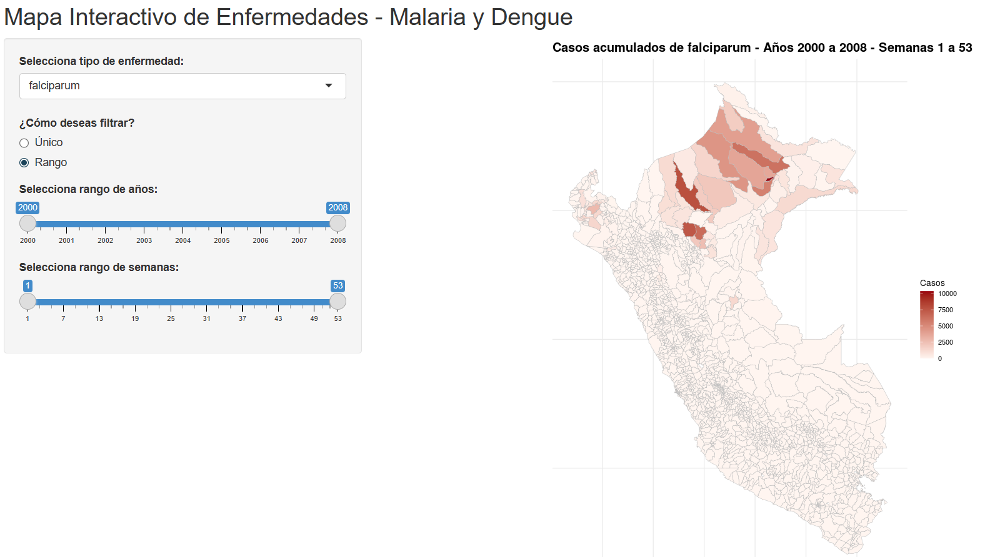

# 🦟 Malaria_AndresF

## 📌 Descripción del proyecto

Este script en **R Shiny** genera una **aplicación web interactiva** que muestra un **mapa temático de casos de malaria** (falciparum y vivax) por distrito en el Perú.

🔗 **[¡Haz clic aquí para ver la aplicación en vivo!](https://andresfigueroa.shinyapps.io/data/)**

---

## 💻 ¿Qué hace el código?

- Carga un **shapefile distrital** (`.shp`) y un archivo **CSV** con datos de malaria.
- Cruza ambos conjuntos de datos mediante el código **UBIGEO**.
- Permite seleccionar:
  - El **tipo de enfermedad**: *falciparum* o *vivax*.
  - Un **año y semana específica** (modo "Único").
  - Un **rango de años y semanas** (modo "Rango").
- Genera un **mapa temático estático** coloreado según el número de casos usando `ggplot2`.
- Se actualiza automáticamente según la selección del usuario.

---

## 📦 Librerías utilizadas

- `shiny`: para la interfaz web interactiva.
- `sf`: para manejo de datos espaciales (shapefiles).
- `readr`, `dplyr`: para la lectura y manipulación de datos.
- `ggplot2`: para la visualización geográfica.

---
